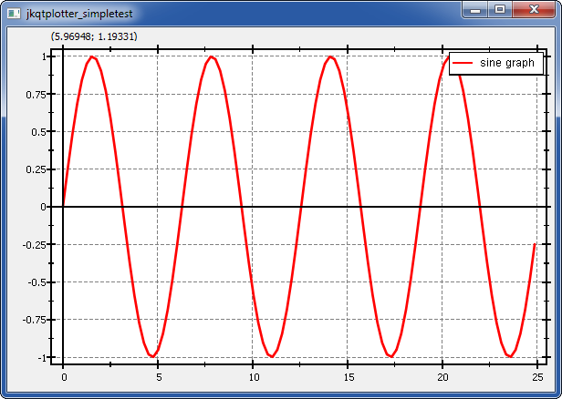

# Example (JKQTPlotter): Very simple line-graph             {#JKQTPlotterSimpleTest}
This project (see `./examples/simpletest/`) simply creates a JKQTPlotter widget (as a new window) and adds a single line-graph (a sine-wave). Data is initialized from two QVector<double> objects.
The QMake project looks like this (see [`jkqtplotter_simpletest.pro`](../simpletest/jkqtplotter_simpletest.pro):
```.qmake
# source code for this simple demo
SOURCES = jkqtplotter_simpletest.cpp 

# configure Qt
CONFIG += qt
QT += core gui xml svg
greaterThan(QT_MAJOR_VERSION, 4): QT += widgets printsupport

# output executable name
TARGET = jkqtplotter_simpletest

# include JKQTPlotter source headers and link against library
DEPENDPATH += . ../../lib
INCLUDEPATH += ../../lib
CONFIG (debug, debug|release) {
    LIBS += -L../../staticlib/debug -ljkqtplotterlib_debug
} else {
    LIBS += -L../../staticlib/release -ljkqtplotterlib
}
```

Alternatively to linking agains a `libjkqtplotter`, you can also directy add the JKQTPlotter sources to the project:
```.qmake
# source code for this simple demo
SOURCES = jkqtplotter_simpletest.cpp 

# configure Qt
CONFIG += qt
QT += core gui svg
greaterThan(QT_MAJOR_VERSION, 4): QT += widgets printsupport

# output executable name
TARGET = jkqtplotter_simpletest

# include JKQTPlotter source code
include(../../lib/jkqtplotter.pri)
```
The source code of the main application is (see [`jkqtplotter_simpletest.cpp`](../simpletest/jkqtplotter_simpletest.cpp):
```.cpp
#include <QApplication>
#include "jkqtplotter/jkqtplotter.h"


int main(int argc, char* argv[])
{
    QApplication app(argc, argv);

    // 1. create a plotter window and get a pointer to the internal datastore 
	//    (for convenience)
    JKQTPlotter plot;
    JKQTPDatastore* ds=plot.getDatastore();

    // 2. now we create data for a simple plot (a sine curve)
    QVector<double> X, Y;
    const int Ndata=100;
    for (int i=0; i<Ndata; i++) {
        const double x=double(i)/double(Ndata)*8.0*M_PI;
        X<<x;
        Y<<sin(x);
    }

    // 3. make data available to JKQTPlotter by adding it to the internal 
	//    datastore.
    //    Note: In this step the data is copied (of not specified otherwise), so
    //          you can reuse X and Y afterwards!
    //    The variables columnX and columnY will contain the internal column ID 
    //    of the newlycreated columns with names "x" and "y" and the (copied) 
	//    data from X and Y.
    size_t columnX=ds->addCopiedColumn(X, "x");
    size_t columnY=ds->addCopiedColumn(Y, "y");

    // 4. create a graph in the plot, which plots the dataset X/Y:
    JKQTPXYLineGraph* graph1=new JKQTPXYLineGraph(&plot);
    graph1->setXColumn(columnX);
    graph1->setYColumn(columnY);
    graph1->setTitle(QObject::tr("sine graph"));

    // 5. add the graph to the plot, so it is actually displayed
    plot.addGraph(graph1);

    // 6. autoscale the plot so the graph is contained
    plot.zoomToFit();

    // show plotter and make it a decent size
    plot.show();
    plot.resize(600,400);

    return app.exec();
}
```
The result looks like this:




