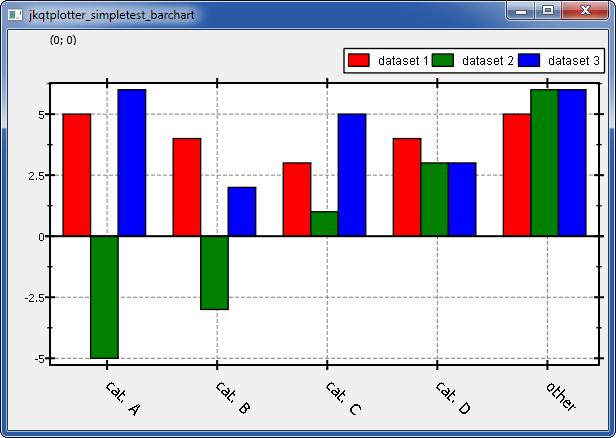

# JKQtPlotter: Examples: Simple barchart {#JKQtPlotterBarcharts}
This project (see [`simpletest_barchart`](../simpletest_barchart) simply creates a JKQtPlotter widget (as a new window) and adds several barcharts. They are ordered in groups.

The soruce code of the main application is (see [`jkqtplotter_simpletest_barchart.cpp`](../simpletest_barchart/jkqtplotter_simpletest_barchart.cpp):
```c++
#include <QApplication>
#include "jkqtplotter/jkqtplotter.h"
#include "jkqtplotter/jkqtpgraphsbarchart.h"

#define Ndata 5
int main(int argc, char* argv[])
{
    QApplication app(argc, argv);

    // 1. create a plotter window and get a pointer to the internal datastore (for convenience)
    JKQtPlotter plot;
    plot.get_plotter()->set_useAntiAliasingForGraphs(true); // nicer (but slower) plotting
    plot.get_plotter()->set_useAntiAliasingForSystem(true); // nicer (but slower) plotting
    plot.get_plotter()->set_useAntiAliasingForText(true); // nicer (but slower) text rendering
    JKQTPdatastore* ds=plot.getDatastore();

    // 2. now we create data for three simple barchart
    QString L[Ndata]={  "cat. A", "cat. B", "cat. C", "cat. D", "other"};
    double  X[Ndata]={        1,        2,        3,        4,       5};
    double Y1[Ndata]={        5,        4,        3,        4,       5};
    double Y2[Ndata]={       -5,       -3,        1,        3,       6};
    double Y3[Ndata]={        6,        2,        5,        3,       6};

    // 3. make data available to JKQtPlotter by adding it to the internal datastore.
    //    Note: In this step the data is copied (of not specified otherwise)
    //    the variables columnX and columnY... will contain the internal column ID of the
    //    newly created columns with names "x" and "y..." and the (copied) data from X
    //    and Y...
    size_t columnX=ds->addCopiedColumn(X, Ndata, "x");
    size_t columnY1=ds->addCopiedColumn(Y1, Ndata, "y1");
    size_t columnY2=ds->addCopiedColumn(Y2, Ndata, "y2");
    size_t columnY3=ds->addCopiedColumn(Y3, Ndata, "y3");

    // 4. create graphs in the plot, which plots the dataset X/Y1, X/Y2 and X/Y3:
    JKQTPbarVerticalGraph* graph1=new JKQTPbarVerticalGraph(&plot);
    graph1->set_xColumn(columnX);
    graph1->set_yColumn(columnY1);
    graph1->set_title(QObject::tr("dataset 1"));
    JKQTPbarVerticalGraph* graph2=new JKQTPbarVerticalGraph(&plot);
    graph2->set_xColumn(columnX);
    graph2->set_yColumn(columnY2);
    graph2->set_title(QObject::tr("dataset 2"));
    JKQTPbarVerticalGraph* graph3=new JKQTPbarVerticalGraph(&plot);
    graph3->set_xColumn(columnX);
    graph3->set_yColumn(columnY3);
    graph3->set_title(QObject::tr("dataset 3"));


    // 5. add the graphs to the plot, so it is actually displayed
    plot.addGraph(graph1);
    plot.addGraph(graph2);
    plot.addGraph(graph3);

    // 6. now we set the graphs, so they are plotted side-by-side
    //    This function searches all JKQTPbarVerticalGraph in the current
    //    plot and sets their shift/scale so they form a nice plot with
    //    side-by-side groups
    graph1->autoscaleBarWidthAndShift(0.75, 1);

    // 7. data is grouped into 5 numbere groups (1..5), but we also have string
    //    labels for these groups (stored in L). In order to display these labels,
    //    we have to tell the x-Axis to use these special labels:
    plot.get_xAxis()->addAxisTickLabels(X, L, Ndata);
    //    also we can rotate the labels a bit (by 45 degree), so they fit better
    plot.get_xAxis()->set_tickLabelAngle(45);
    plot.get_xAxis()->set_tickLabelFontSize(12);

    // 8. finally we move the plot key/legend to the outside, top-right
    //    and lay it out as a single row
    //    NOTE: plot is a descendent of QWidget, which uses an internal object of
    //          type JKQTBasePlotter, which does the actual plotting.
    //          So many properties of the plot are only available in this internal
    //          object, which you can access by plot.get_plotter().
    plot.get_plotter()->set_keyPosition(JKQTPkeyOutsideTopRight);
    plot.get_plotter()->set_keyLayout(JKQTPkeyLayoutOneRow);

    // 9 autoscale the plot so the graph is contained
    plot.zoomToFit();

    // show plotter and make it a decent size
    plot.show();
    plot.resize(600,400);

    return app.exec();
}
```
The result looks like this:




