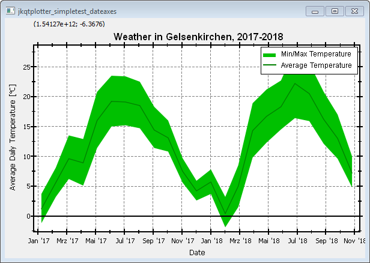
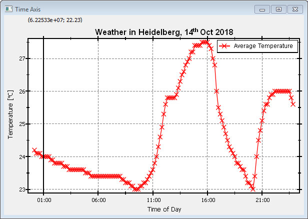

[Back to JKQTPlotter main page](../../README.md)

# JKQtPlotter

## Date/Time Axes

### Date Axis
This project (see `./examples/simpletest_dateaxes/`) simply creates a JKQtPlotter widget (as a new window) with the X-axis showing time or date(-time) values, formated as such. 

The source code of the main application can be found in  [`jkqtplotter_simpletest_dateaxes.cpp`](../simpletest_dateaxes/jkqtplotter_simpletest_dateaxes.cpp). 

First some data is parsed from a CSV-file (added as ressource to the example). Note that the Time/date or Date+Time data is internally stored as milliseconds since epoc (Jan 1st 1970, 00:00:00), therefore data has to be converted accordingly before beeing added to the graph.

```c++
	QVector<double> date;
    QVector<double> temperature, temperature_min, temperature_max;
    // parse a textfile with comments on the first line and the
    // semicolon separated data. The first column is a date and time
    // the second to fourth columns contain a floating-point number
    // with temperature average, min and max
    QFile file(":/weatherdata_gelsenkirchen.csv");
    file.open(QFile::ReadOnly|QFile::Text);
    file.readLine(); // eat comment
    while (!file.atEnd()) {
        QString line=file.readLine();
        QTextStream in(&line);
        QStringList items=line.split(";");
        // date/time values are stored as doubles representing the corresponding number of milliseconds sind epoch
        date<<QDateTime::fromString(items[0], Qt::ISODate).toUTC().toMSecsSinceEpoch();
        // store Heidelbergs daily temperature
        temperature<<items[1].toDouble();
        temperature_min<<items[2].toDouble();
        temperature_max<<items[3].toDouble();
    }
```

The parsed data looks like this (data was taken from http://wetter.mpg-ge.de/NOAA/NOAA-2018.txt and http://wetter.mpg-ge.de/NOAA/NOAA-2017.txt):
```
	ISO-Date+Time;Temp_mean[degC];Temp_min[degC];Temp_max[degC]
	2017-01-15T12:00; 1.2; -1.2; 3.7
	2017-02-15T12:00; 5.6; 3.2; 8.1
	2017-03-15T12:00; 9.6; 6.2; 13.5
	...
```

Then two graphs are added. One of type `JKQTPfilledVerticalRangeGraph` plots the range of min+max temperature for each month:
```c++
   // 3. add a plot for the data mean line (graphTemperature) and range (graphTemperatureRange)
    JKQTPfilledVerticalRangeGraph* graphTemperatureRange=new JKQTPfilledVerticalRangeGraph(&plot);

    // 4. copy data into datastore and immediately set the yColumn
    size_t colDate=ds->addCopiedColumn(date, "date");
    graphTemperatureRange->set_xColumn(colDate);
    graphTemperatureRange->set_yColumn(ds->addCopiedColumn(temperature_min, "temperature_min"));
    graphTemperatureRange->set_yColumn2(ds->addCopiedColumn(temperature_max, "temperature_max"));


    // 5. min/max range data
    // graph fill color is a lighter shade of the average graph
    graphTemperatureRange->set_fillColor(graphTemperature->get_color().lighter());
    // don't draw lines of the data
    graphTemperatureRange->set_drawLine(false);
    // plot label in key
    graphTemperatureRange->set_title("Min/Max Temperature");
    // add the graph to the plot, so it is actually displayed
    plot.addGraph(graphTemperatureRange);
```

On top of that plot, a second plot is added, which draws the average temperatures of each month as a line:

```c++
   // 3. add a plot for the data mean line (graphTemperature) and range (graphTemperatureRange)
    JKQTPxyLineErrorGraph* graphTemperature=new JKQTPxyLineErrorGraph(&plot);

    // 4. copy data into datastore and immediately set the yColumn
    size_t colDate=ds->addCopiedColumn(date, "date");
    graphTemperature->set_xColumn(colDate);
    graphTemperature->set_yColumn(ds->addCopiedColumn(temperature, "temperature"));


    // 5. min/max range data
    // .... see above

    // 6. average data
    // don't use symbols
    graphTemperature->set_symbol(JKQTPnoSymbol);
    // set the line width
    graphTemperature->set_lineWidth(1);
    // draw small symbols
    graphTemperature->set_symbolSize(6);
    // graph title
    graphTemperature->set_title("Average Temperature");
    // add the graph to the plot, so it is actually displayed
    plot.addGraph(graphTemperature);
```

Finally the x-axis is formatted to display dates (see [Qt-Documentation of `QDateTime::toString()`]((http://doc.qt.io/qt-5/qdatetime.html#toString) for details on the formating strings):
```c++
    // 7. format the plot
    // set the title above the plot, use LaTeX instructions to make text bold
    plot.get_plotter()->set_plotLabel("\\textbf{Weather in Gelsenkirchen, 2017-2018}");
    // set x-axis date-time-axis
    plot.get_xAxis()->set_labelType(JKQTPCALTdatetime);
    plot.get_xAxis()->set_axisLabel("Date");
    // set format string for date axis (e.g. Jan '18), see Documentation of QDateTime::toString()
    plot.get_xAxis()->set_tickDateTimeFormat("MMM ''yy");
    // set y-axis temperature axis
    plot.get_yAxis()->set_axisLabel("Average Daily Temperature [{\\degree}C]");
```

The result looks like this:




### Time Axis
A second variant (see the example CPP-file) displays data with a time-axis:




For that example data-pasring is a bit different, because the file only contains times and no dates:
```c++
    // 2. now we create data vectors with data parsed from a CSV-file
    QVector<double> time;
    QVector<double> temperature;
    // parse a textfile with comments on the first line and the
    // semicolon separated data. The first column is a time
    // the second contain a floating-point number with temperatures
    QFile file(":/weatherdata_heidelberg_2018-10-14.csv");
    file.open(QFile::ReadOnly|QFile::Text);
    file.readLine(); // eat comment
    while (!file.atEnd()) {
        QString line=file.readLine();
        QTextStream in(&line);
        QStringList items=line.split(";");
        // date/time values are stored as doubles representing the corresponding
        // number of milliseconds sind epoch. Since the data is time only, we have to use an arbitrary
        // date as basis
        time<<QDateTime::fromString("1970-01-01T"+items[0], Qt::ISODate).toUTC().toMSecsSinceEpoch();
        // store Heidelbergs daily temperature
        temperature<<items[1].toDouble();
    }
```

The parsed data looks like this:
```
	Time;     Temperature [degC]
	00:00:00; 24.2
	00:10:00; 24.2
	00:20:00; 24.1
	00:30:00; 24.1
	...
```

Axis formating for this example is done like this:
```c++
    // 7. format the plot
    // set the title above the plot, use LaTeX instructions to make text bold
    plot.get_plotter()->set_plotLabel("\\textbf{Weather in Heidelberg, 14^{th} Oct 2018}");
    // set x-axis date-time-axis
    plot.get_xAxis()->set_labelType(JKQTPCALTtime);
    plot.get_xAxis()->set_axisLabel("Time of Day");
    // set format string for time axis with 24-hour and minute only,
    // see QDateTime::toString() documentation for details on format strings
    plot.get_xAxis()->set_tickTimeFormat("HH:mm");
    // set y-axis temperature axis
    plot.get_yAxis()->set_axisLabel("Temperature [{\\degree}C]");
```

[Back to JKQTPlotter main page](../../README.md)