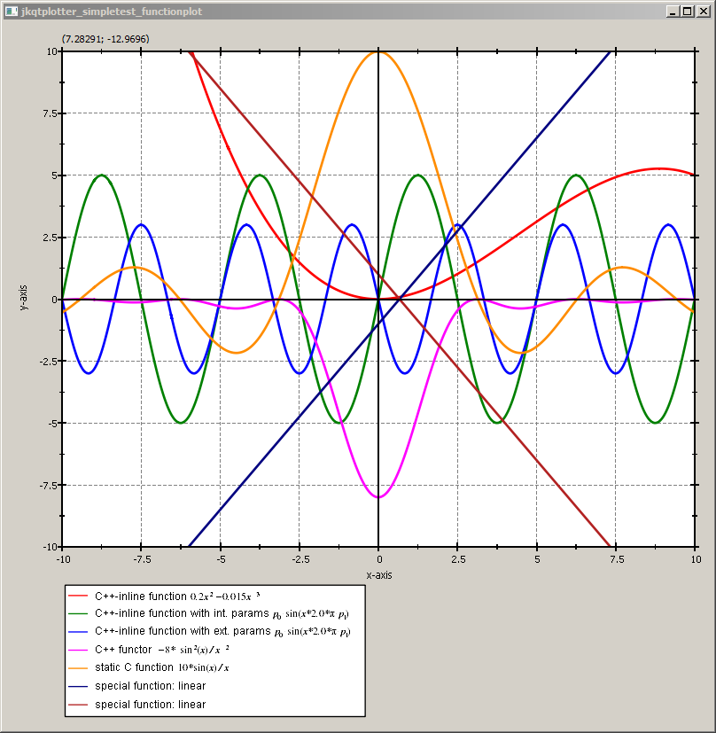
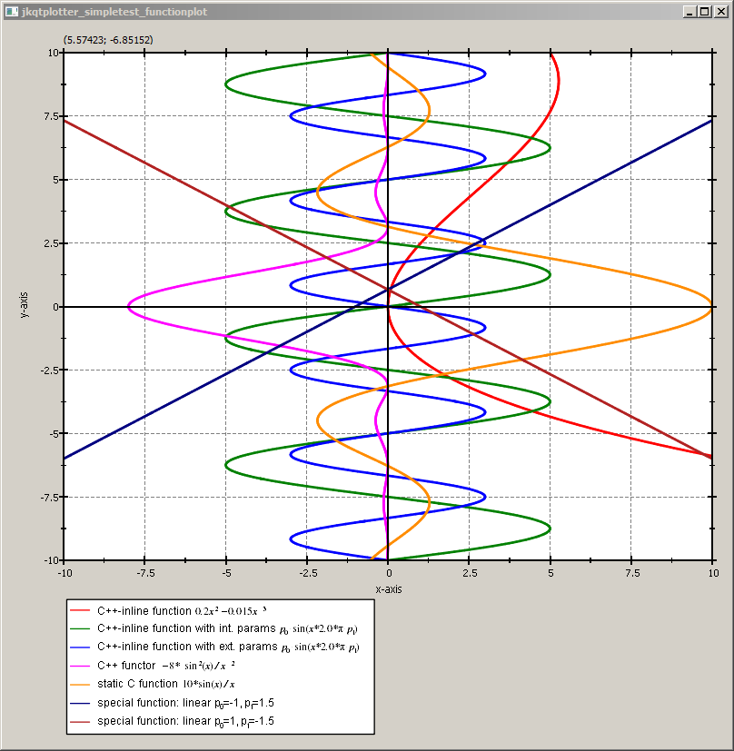

[Back to JKQTPlotter main page](../../README.md)

# JKQtPlotter

## Plotting Mathematical Functions as Line Graphs
### Basics
This project (see `./examples/simpletest_functionplot/`) demonstrates how to plot mathematical functions as line graphs. The functions may be defined as static C functions, C++ functors or c++ inline functions. See [test/simpletest_parsedfunctionplot](../simpletest_parsedfunctionplot) for an example of how to use an internal equation parser provided with JKQtPlotter instead of directly defining functions.

### Simple C++ inline function
The first example shows how to plot a C++ inline function: 
```c++
    JKQTPxFunctionLineGraph* func1=new JKQTPxFunctionLineGraph(plot);
    func1->set_plotFunction([](double x) { return 0.2*x*x-0.015*x*x*x; });
    func1->set_title("C++-inline function $0.2x^2-0.015x^3$");
    plot->addGraph(func1);
```

### Simple C++ inline function with parameters
In any such plot function, you can also use parameters, provided via the second parameter. Usually these are "internal parameters", defined by `func2->set_paramsV(p0, p1, ...)`:
```c++
    JKQTPxFunctionLineGraph* func2=new JKQTPxFunctionLineGraph(plot);
    func2->set_plotFunction([](double x, void* params) {
        QVector<double>* p=static_cast<QVector<double>*>(params);
        return p->at(0)*sin(2.0*M_PI*x*p->at(1));
    });
    // here we set the parameters p0, p1
    func2->set_paramsV(5, 0.2);
    func2->set_title("C++-inline function with int. params $p_0\\cdot\\sin(x*2.0*\\pi\\cdot p_1)$");
    plot->addGraph(func2);
```

... but generally any pointer can be used as parameter (the set by `set_parameter(static_cast<void*>(myDataObject))`):
```c++
    JKQTPxFunctionLineGraph* func3=new JKQTPxFunctionLineGraph(plot);
    func3->set_plotFunction([](double x, void* params) {
        QMap<QString,double>* p=static_cast<QMap<QString,double>*>(params);
        return p->value("amplitude")*sin(2.0*M_PI*x*p->value("frequency"));
    });
    // here we set the parameters p0, p1
    QMap<QString,double> params3;
    params3["amplitude"]=-3;
    params3["frequency"]=0.3;
    func3->set_params(&params3);
    func3->set_title("C++-inline function with ext. params $p_0\\cdot\\sin(x*2.0*\\pi\\cdot p_1)$");
    plot->addGraph(func3);
```

### C++ functors as plot functions
You can also use C++ functors (or function objects):
```c++
    struct SincSqr {
    public:
        inline SincSqr(double amplitude): a(amplitude) {}
        inline double operator()(double x) {
            return a*sin(x)*sin(x)/x/x;
        }
    private:
        double a;
    };

    // ...
    
    JKQTPxFunctionLineGraph* func4=new JKQTPxFunctionLineGraph(plot);
    func4->set_plotFunction(SincSqr(-8));
    func4->set_title("C++ functor $-8*\\sin^2(x)/x^2$");
    plot->addGraph(func4);
```

### Static C functions
You can also plot simple static C functions:
```c++
    double sinc(double x) {
        return 10.0*sin(x)/x;
    }
    
    // ...

    JKQTPxFunctionLineGraph* func5=new JKQTPxFunctionLineGraph(plot);
    func5->set_plotFunction(&sinc);
    func5->set_title("static C function $10*\\sin(x)/x$");
    plot->addGraph(func5);
```

### Predefined "special" functions
Finally `JKQTPxFunctionLineGraph` provides a small set of special functions (polynomial `p0+p1*x+p2*x^2+...`, exponential `p0+p1*exp(x/p2)`, power-law `p0+p1*x^p2`, ...), which are parametrized from the internal or external parameters:
```c++
    JKQTPxFunctionLineGraph* func6=new JKQTPxFunctionLineGraph(plot);
    func6->setSpecialFunction(JKQTPxFunctionLineGraph::Line);
    // here we set offset p0=-1 and slope p1=1.5 of the line p0+p1*x
    func6->set_paramsV(-1,1.5);
    func6->set_title("special function: linear");
    plot->addGraph(func6);
```

To demonstrate how to use parameters from a datastore column, have a look at the next example. It is derived from the special-function plot above, but adds a line with a different offset and slope and reads the parameters from a datastore column `paramCol`, which is initialized from the vector `params`:
```c++
JKQTPxFunctionLineGraph* func7=new JKQTPxFunctionLineGraph(plot);
    func7->setSpecialFunction(JKQTPxFunctionLineGraph::Line);
    // here we set offset p0=1 and slope p1=-1.5 of the line p0+p1*x by adding these into a column
    // in the internal datastore and then set that column as parameterColumn for the function graph
    QVector<double> params;
    params << /*p0=*/1 << /*p1=*/-1.5;
    size_t paramCol=plot->getDatastore()->addCopiedColumn(params);
    func7->set_parameterColumn(paramCol);
    func7->set_title("special function: linear");
    plot->addGraph(func7);
```

### Screenshot
This code snippets above result in a plot like this:



### Notes
Note that all the different variants to provide parameters can be used with all types of functions!

Also see the example [Plotting Parsed Mathematical Functions as Line Graphs](../simpletest_parsedfunctionplot) for details on how the actual plotting algorithm works. That example also shows how to define a function as a string, which is then parsed and evaluated by an expression parser library embedded in JKQtPlotter.

All examples above use the graph class `JKQTPxFunctionLineGraph`, which plots a function `y=f(x)`. If you want to plot a function `x=f(y)`, you can use the class `JKQTPyFunctionLineGraph` instead. If in the examples above, we exchange all `JKQTPxFunctionLineGraph` for `JKQTPyFunctionLineGraph`, the graphs will be rotated by 90 degree, as all functions are interpreted as `x=f(y)`:




[Back to JKQTPlotter main page](../../README.md)