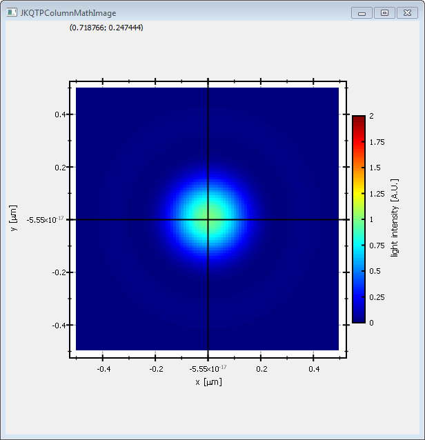
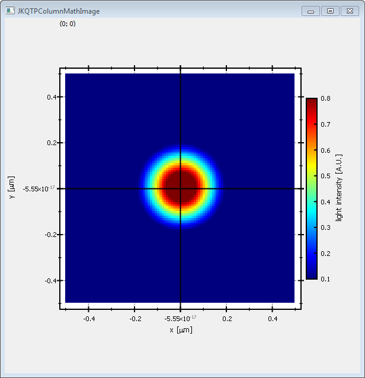
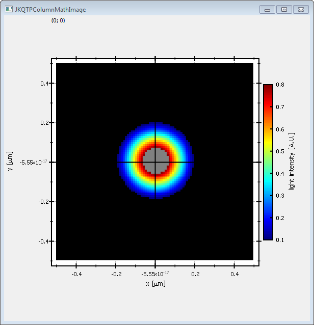
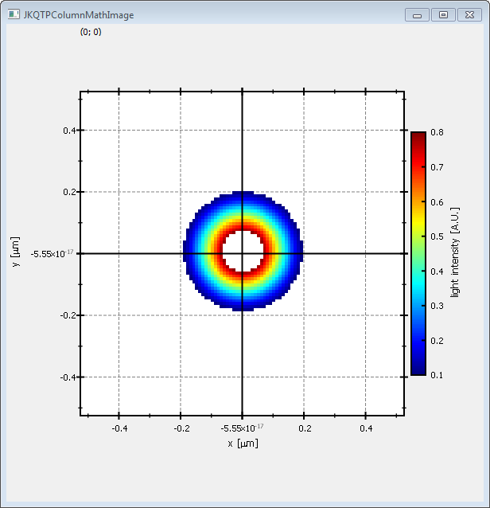

# Example (JKQTPlotter): Simple math image plot {#JKQTPlotterImagePlot}
This project (see `./examples/simpletest_imageplot/`) simply creates a JKQTPlotter widget (as a new window) and adds a color-coded image plot of a mathematical function (here the Airy disk). The image is stored as a simple C-array in row-major ordering and then copied into a single column of the internal datasdtore (JKQTPMathImage could be directly used without the internal datastore). This very simple interface can also be used to interface with many common image processing libraries, like CImg or OpenCV.

The source code of the main application is (see [`jkqtplotter_simpletest_imageplot.cpp`](../simpletest_imageplot/jkqtplotter_simpletest_imageplot.cpp):
```.cpp
#include <QApplication>
#include <cmath>
#include "jkqtplotter/jkqtplotter.h"
#include "jkqtplotter/jkqtpgraphsimage.h"

#ifndef M_PI
#define M_PI 3.14159265358979323846
#endif


int main(int argc, char* argv[])
{
    QApplication app(argc, argv);

    JKQTPlotter plot;
    // 1. create a plotter window and get a pointer to the internal datastore (for convenience)
    plot.get_plotter()->set_useAntiAliasingForGraphs(true); // nicer (but slower) plotting
    plot.get_plotter()->set_useAntiAliasingForSystem(true); // nicer (but slower) plotting
    plot.get_plotter()->set_useAntiAliasingForText(true); // nicer (but slower) text rendering
    JKQTPDatastore* ds=plot.getDatastore();

    // 2. now we create data for the charts (taken from https://commons.wikimedia.org/wiki/File:Energiemix_Deutschland.svg)
    const int NX=100; // image dimension in x-direction [pixels]
    const int NY=100; // image dimension in x-direction [pixels]
    const double dx=1e-2; // size of a pixel in x-direction [micrometers]
    const double dy=1e-2; // size of a pixel in x-direction [micrometers]
    const double w=static_cast<double>(NX)*dx;
    const double h=static_cast<double>(NY)*dy;
    double airydisk[NX*NY]; // row-major image

    // 2.1 Parameters for airy disk plot (see https://en.wikipedia.org/wiki/Airy_disk)
    double NA=1.1; // numerical aperture of lens
    double wavelength=488e-3; // wavelength of the light [micrometers]

    // 2.2 calculate image of airy disk in a row-major array
    double x, y=-h/2.0;
    for (int iy=0; iy<NY; iy++ ) {
        x=-w/2.0;
        for (int ix=0; ix<NX; ix++ ) {
            const double r=sqrt(x*x+y*y);
            const double v=2.0*M_PI*NA*r/wavelength;
            airydisk[iy*NX+ix] = pow(2.0*j1(v)/v, 2);
            x+=dx;
        }
        y+=dy;
    }


    // 3. make data available to JKQTPlotter by adding it to the internal datastore.
    //    In this step the contents of C-array airydisk is copied into a column
    //    of the datastore in row-major order
    size_t cAiryDisk=ds->addCopiedImageAsColumn(airydisk, NX, NY, "imagedata");

	
    // 4. create a graph (JKQTPColumnMathImage) with the column created above as data
    //    The data is color-coded with the color-palette JKQTPMathImageMATLAB
    //    the converted range of data is determined automatically because set_autoImageRange(true)
    JKQTPColumnMathImage* graph=new JKQTPColumnMathImage(&plot);
    graph->set_title("");
    // image column with the data
    graph->set_imageColumn(cAiryDisk);
    // set size of the data (the datastore does not contain this info, as it only manages 1D columns of data and this is used to assume a row-major ordering
    graph->set_Nx(NX);
    graph->set_Ny(NY);
    // where does the image start in the plot, given in plot-axis-coordinates (bottom-left corner)
    graph->set_x(-w/2.0);
    graph->set_y(-h/2.0);
    // width and height of the image in plot-axis-coordinates
    graph->set_width(w);
    graph->set_height(h);
    // color-map is "MATLAB"
    graph->set_palette(JKQTPMathImageMATLAB);
    // get coordinate axis of color-bar and set its label
    graph->get_colorBarRightAxis()->set_axisLabel("light intensity [A.U.]");
    // determine min/max of data automatically and use it to set the range of the color-scale
    graph->set_autoImageRange(true);

	
	
    // 5. add the graphs to the plot, so it is actually displayed
    plot.addGraph(graph);

	
    // 6. set axis labels
    plot.get_xAxis()->set_axisLabel("x [{\\mu}m]");
    plot.get_yAxis()->set_axisLabel("y [{\\mu}m]");

	
    // 7. fix axis and plot aspect ratio to 1
    plot.get_plotter()->set_maintainAspectRatio(true);
    plot.get_plotter()->set_maintainAxisAspectRatio(true);

    // 8 autoscale the plot so the graph is contained
    plot.zoomToFit();

    // show plotter and make it a decent size
    plot.show();
    plot.resize(600,600);
    plot.setWindowTitle("JKQTPColumnMathImage");


    return app.exec();
}

```
The result looks like this:


There are several ways to modify the plot:
  1. You can set the color scale manually (here 0..2), by using
    ```
    graph->set_autoImageRange(false);
    graph->set_imageMin(0);
    graph->set_imageMax(2);
	```
	instead of 
    ```
    graph->set_autoImageRange(true);
	```
	from above. The result will look like this:<br>
	<br>
	Note how the color scale is not used completely, because data really only scales between 0 and 1.
  2. If you set the color-range to 0.1 .. 0.8 with
    ```
    graph->set_autoImageRange(false);
    graph->set_imageMin(0.1);
    graph->set_imageMax(0.8);
	```
	Then there will be datapoints above or below the range of the colorscale. The default behaviour of the graph is to use the first color of the palette for every pixel with a value below the minimum (here 0.1) and the last color in the palette for every pixel with a value above the maximum.<br>
	<br>
	You can change this behaviour by `set_rangeMinFailAction(),set_rangeMaxFailAction()` with one of these parameters:
	  - `JKQTPMathImageLastPaletteColor`: the default behaviour explained above
	  - `JKQTPMathImageGivenColor`: use a color set by `set_rangeMinFailColor(),set_rangeMaxFailColor()` (here e.g. black for min and grey for max)<br>
	    
	  - `JKQTPMathImageTransparent`: draw pixels transparent<br>
	    
    .
.


