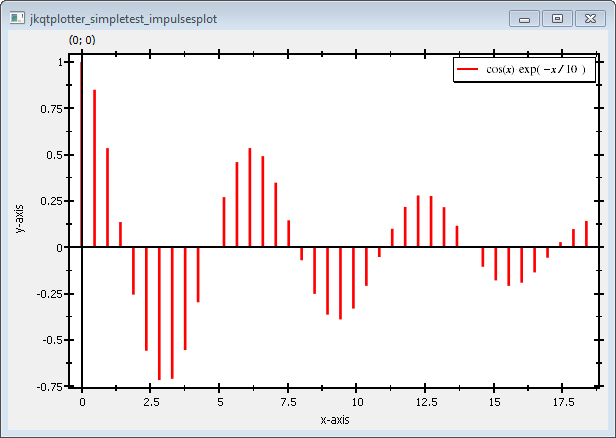
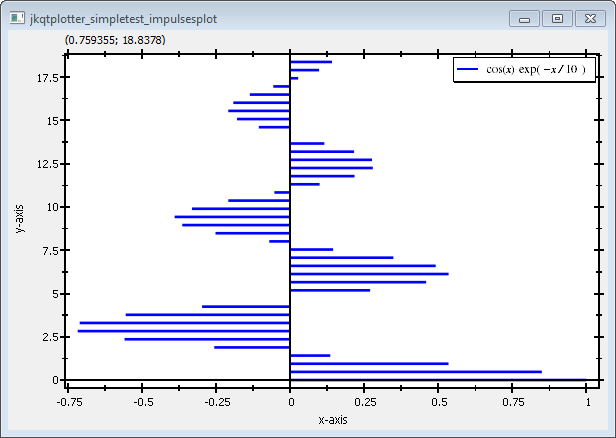

# Example (JKQTPlotter): Simple impulse plots {#JKQTPlotterImpulsePlots}
This project (see `./examples/simpletest_impulsesplot/`) simply creates a JKQTPlotter widget (as a new window) and adds a single impulse graph. 
The source code of the main application is (see [`jkqtplotter_simpletest_impulsesplot.cpp`](../simpletest_impulsesplot/jkqtplotter_simpletest_impulsesplot.cpp).


First data for a curve is calculated and stored in `QVector<double>`: 
```.cpp
    QVector<double> X, Y;
    for (int i=0; i<Ndata; i++) {
        const double xx=double(i)/double(Ndata)*6.0*M_PI;
        X << xx;
        Y << cos(xx)*exp(-xx/10.0);
    }
```

... and finally the data is copied into the datastore
```.cpp
    size_t columnX=ds->addCopiedColumn(X,  "x");
    size_t columnY=ds->addCopiedColumn(Y,  "y");
```
	
Now an impulse graph object is generated and added to the plot:
```.cpp
    JKQTPImpulsesVerticalGraph* graph=new JKQTPImpulsesVerticalGraph(&plot);
    graph->set_xColumn(columnX);
    graph->set_yColumn(columnY);
	graph->setLineWidth(2);
	graph->set_color(QColor("red"));
    graph->set_title(QObject::tr("$\\cos(x)\\cdot\\exp(-x/10)$"));

    plot.addGraph(graph);
```

The result looks like this:



There is an alternative class `JKQTPImpulsesHorizontalGraph` which draws horizontal impulse plots:
```.cpp
    JKQTPImpulsesHorizontalGraph* graph=new JKQTPImpulsesHorizontalGraph(&plot);
    graph->set_yColumn(columnX);
    graph->set_xColumn(columnY);
    graph->setLineWidth(2);
    graph->set_color(QColor("blue"));
    graph->set_title(QObject::tr("$\\cos(x)\\cdot\\exp(-x/10)$"));
```

This code snippet results in a plot like this:




