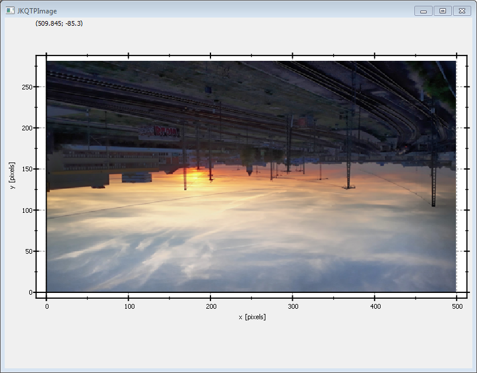

[Back to JKQTPlotter main page](../../README.md)

# JKQtPlotter

## `QImage` as a Graph
This project (see `./examples/simpletest_rgbimageplot_qt/`) simply creates a JKQtPlotter widget (as a new window) and adds an image plot with an image taken from a [QImage](http://doc.qt.io/qt-5/qimage.html) object. 

The source code of the main application is (see [`jkqtplotter_simpletest_rgbimageplot_qt.cpp`](../simpletest_rgbimageplot_qt/jkqtplotter_simpletest_rgbimageplot_qt.cpp). the main parts are:
```c++
    // 2. now we open a BMP-file and load it into an OpenCV cv::Mat
    QImage image(":/example.bmp");

    // 3. create a graph (JKQTPImage) with a pointer to the QImage-object, generated above
    JKQTPImage* graph=new JKQTPImage(&plot);
    graph->set_title("");
    // copy the image into the graph (optionally you could also give a pointer to a QImage,
    // but then you need to ensure that the QImage is available as long as the JKQTPImage
    // instace lives)
    graph->set_image(image);
    // where does the image start in the plot, given in plot-axis-coordinates (bottom-left corner)
    graph->set_x(0);
    graph->set_y(0);
    // width/height of the image in plot coordinates
    graph->set_width(image.width());
    graph->set_height(image.height());

    // 4. add the graphs to the plot, so it is actually displayed
    plot.addGraph(graph);
```
The result looks like this:




[Back to JKQTPlotter main page](../../README.md)
