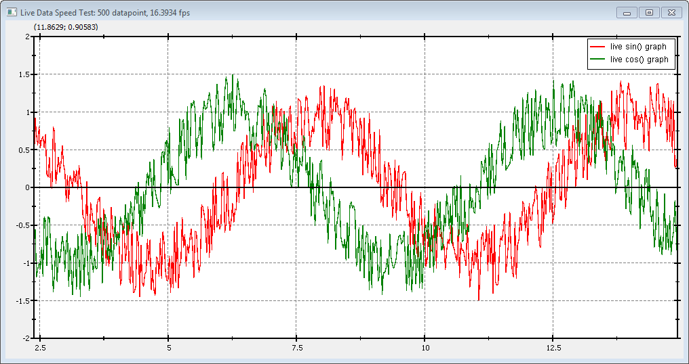
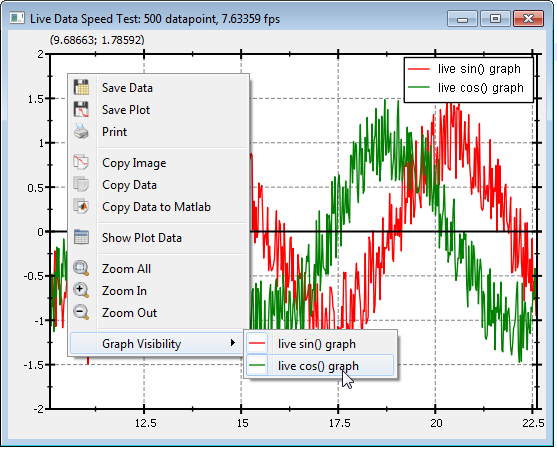

# Example (JKQTPlotter): Simple line-graph with live-data (speed test) {#JKQTPlotterSpeedTest}
This project (see `./examples/simpletest_speed/`) simply creates a JKQTPlotter widget (as a new window) and adds two line-graph (a sine and a cosine wave). 
Data is stored in two [`std::array<double, NDATA>`](https://en.cppreference.com/w/cpp/container/array) objects (`X`, `Y`, and `Y2`) and the data is added as external pointer to the datastore:
```.cpp
    // 3. make data available to JKQTPlotter by adding it to the internal datastore.
    //    Here the data from the std::array's is not copied, but only the pointer to
    //    the array is added to the datastore. therefore the datastore does not manage
    //    the memory, oly uses the data stored in it!
    JKQTPDatastore* ds=getDatastore();
    size_t columnX=ds->addColumn(X.data(), X.size(), "x");
    size_t columnY=ds->addColumn(Y.data(), Y.size(), "y");
    size_t columnY2=ds->addColumn(Y2.data(), Y2.size(), "y2");
```
The datastore then uses the data from the `std::array` instances, but does not own their memory, i.e. also does not free it. This is useful, when data fro external sources should be used without copying.

For this example we also don't use axis autoscaling, but set the axes explicitly:
```.cpp
    // 6. scale the plot so the graph is contained
    setX(X[0], X[NDATA-1]);
    setY(-2,2);
```

Finally a slot is started with a one-shot timer. In that slot, the data is shifted one place to the left and the graph is updated. The slot also calculated the current framerate and displays it in the window title. Finally a single-shot timer with 1ms delay is used to call the slot again (i.e. continuously):
```.cpp
void SpeedTestPlot::plotNewData()
{
    // move old data to the left
    for (size_t i=0; i<NDATA-1; i++) {
        X[i]=X[i+1];
        Y[i]=Y[i+1];
        Y2[i]=Y2[i+1];
    }
    // add one new data point
    X[NDATA-1]=X[NDATA-2]+dx;
    Y[NDATA-1]=sin(X[NDATA-1])+static_cast<double>(std::rand())/static_cast<double>(RAND_MAX + 1u)-0.5;
    Y2[NDATA-1]=cos(X[NDATA-1])+static_cast<double>(std::rand())/static_cast<double>(RAND_MAX + 1u)-0.5;

    // set new x-range and replot
    setX(X[0], X[NDATA-1]);
    redrawPlot();

    // calculate and update FPS-rate in window title
    auto tlastalst=t_lastplot;
    t_lastplot=std::chrono::system_clock::now();
    double delta_secs=static_cast<double>(std::chrono::duration_cast<std::chrono::milliseconds>(t_lastplot-tlastalst).count())/1000.0;
    setWindowTitle(QString("Live Data Speed Test: %2 datapoint, %1 fps").arg(1/delta_secs).arg(NDATA));
    // enqueue call for next data value
    QTimer::singleShot(1, this, SLOT(plotNewData()));
}
``` 

The result looks like this:



There are different facor affecting the replot speed:
1. *Anti-Aliasing:* If `JKQTPlotter` uses Anti-Aliasing for plotting, the plots are much nicer, but also about a factor of 3-4 slower. This is due to the increased amount of calculations, necessary in the drawing sub-system of Qt.
   You can configrue anti-aliasing with these calls:
   ```.cpp
      plot.getPlotter()->setUseAntiAliasingForGraphs(false);
      plot.getPlotter()->setUseAntiAliasingForSystem(false);
      plot.getPlotter()->setUseAntiAliasingForText(false);
	```
2. *Number of Graphs:* The number of plots (and also ther type and complexity) is a major imapct factor in the plotting speed. You can switch off a plot with the context menu:<br>
3. *Axis Scales and Plot Appearance:* Replotting is done in two steps: First the plot with the axes, labels etc. is drawn. Then the graphs are draw on top. Therefore a replot is faster, if only the graphs change, because the background (plot) does not have to be replotted.


the next table summarizes some results for plotting speed under different conditions, obatined with the test program in this directory (conditions: Qt 5.11, 32-bit, MinGW, Release, Phenom II X4 765, 500 data points):

| Anti-Aliasing    | X-Axis Redraw   | # Graphs      | frame rate [fps] |
| ---------------- | --------------- | ------------- | ---------------- |
| yes              | yes             | 2             |  4               |
| yes              | yes             | 1             |  7               |
| yes              | no              | 2             |  9               |
| yes              | no              | 1             | 16               |
| no               | yes             | 2             | 18               |
| no               | yes             | 1             | 24               |
| no               | no              | 2             | 32               |
| no               | no              | 1             | 48               |


