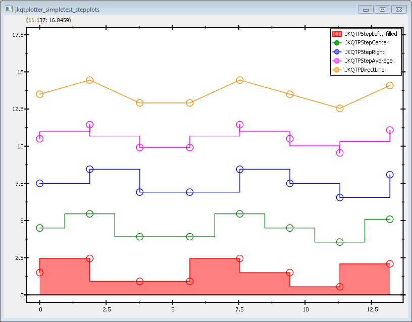

# Example (JKQTPlotter): Step Line Plots in Different Styles {#JKQTPlotterStepPlot}
This project (see `./examples/simpletest_stepplots/`) simply creates a JKQTPlotter widget (as a new window) and adds a single line-graph (a sine-wave). Data is initialized from two QVector<double> objects.

The source code of the main application can be found in  [`jkqtplotter_simpletest_stepplots.cpp`](../simpletest_stepplots/jkqtplotter_simpletest_stepplots.cpp). For the most part, several datasets of cosine-curves are generated. then thrre tuples of graphs are added: One of type `JKQTPXYLineGraph`, which simply indicates the location of the actual datapoints. the second is of type `JKQTPStepHorizontalGraph`, which adds the step-graph to the plot:

```.cpp
	// 3 now we make several plots with different step styles, each one also contains a
    //     symbol plot indicating the location of the datapoints themselves
    JKQTPStepHorizontalGraph* graph;
    JKQTPXYLineGraph* graphL;

    //-- JKQTPStepLeft ----------------------------------------------------------------------------------------
    graph=new JKQTPStepHorizontalGraph(&plot);
    graphL=new JKQTPXYLineGraph(&plot);

    // set data for both graphs
    graph->set_xColumn(columnX); graphL->set_xColumn(graph->get_xColumn());
    graph->set_yColumn(columnY1); graphL->set_yColumn(graph->get_yColumn());

    // set step style
    graph->set_stepType(JKQTPStepLeft);
    graph->set_lineWidth(1);
    graph->set_fillCurve(true);
    graph->set_drawLine(true);
    graph->set_title("JKQTPStepLeft, filled");
```
Note that you can configure the step type (left/center/right by `graph->set_stepType(JKQTPStepLeft)`. With `graph->set_fillCurve(true)` you can draw the curve filled until the y=0-axis and with `graph->set_drawLine(true)` you can switch the line along the values on and off (e.g. to only have the filled area, but no line).

Finally the `JKQTPXYLineGraph` is configured:
```.cpp
    // set symbol + pen style and color for the added circles, copy color
    graphL->set_symbol(JKQTPGraphSymbols::JKQTPCircle);
    graphL->set_drawLine(false);
    graphL->set_symbolSize(9);
    graphL->set_symbolWidth(1);
    graphL->set_color(graph->get_color());
```

... and all graphs are added to the plot:
```.cpp
    // add the graphs to the plot, so it is actually displayed
    plot.addGraph(graph);
    plot.addGraph(graphL);
```

In addition to the symbol type and line style, you can also alter the size of the symbols (`graph->set_symbolSize(14)`), the line-width used to draw them (`graph->set_symbolWidth(1.5)`) and the line width of the graph line (`graph->set_lineWidth(1)`). If you want to switch off the line altogether, use `graph->set_drawLine(false`.

The result looks like this:




