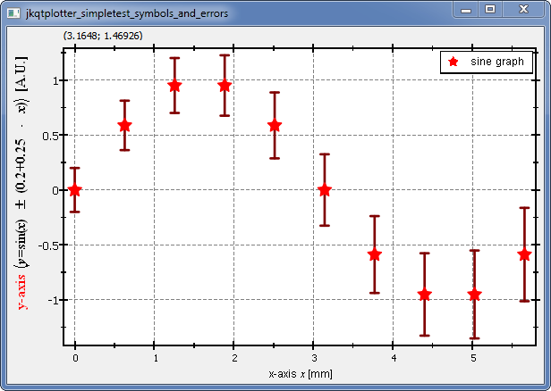

# Example (JKQTPlotter): Simple line-graph with error bars {#JKQTPlotterSymbolsErrors}
This project (see `./examples/simpletest_symbols_and_errors/`) simply creates a JKQTPlotter widget (as a new window) and adds a single line-graph (a sine-wave) that has y-errorbars. In addition, this example shows how to change some of the axis properties and how to use LaTeX markup to format axis labels (can actually be used for all labels in JKQTPlotter). Also, in comparison to the last example, here we initialize the data from C-type arrays (double*), instead of QVector<double> objects.

The source code of the main application is (see [`jkqtplotter_simpletest_symbols_and_errors.cpp`](../simpletest_symbols_and_errors/jkqtplotter_simpletest_symbols_and_errors.cpp):
```.cpp
#include <QApplication>
#include "jkqtplotter/jkqtplotter.h"

// number of datapoints:
#define Ndata 10

int main(int argc, char* argv[])
{
    QApplication app(argc, argv);

    // 1. create a plotter window and get a pointer to the internal datastore (for convenience)
    JKQTPlotter plot;
    JKQTPDatastore* ds=plot.getDatastore();

    // 2. now we create data for a simple plot (a sine curve with lin. increasing errors)
    double X[Ndata], Y[Ndata], YERROR[Ndata];
    for (int i=0; i<Ndata; i++) {
        X[i]=double(i)/double(Ndata)*2.0*M_PI;
        Y[i]=sin(X[i]);
        YERROR[i]=0.2+double(i)/double(Ndata)*0.25;
    }

    // 3. make data available to JKQTPlotter by adding it to the internal datastore.
    //    Note: In this step the data is copied (of not specified otherwise), so you can
    //          reuse X and Y afterwards!
    //    the variables columnX and columnY will contain the internal column ID of the newly
    //    created columns with names "x" and "y" and the (copied) data from X and Y.
    size_t columnX=ds->addCopiedColumn(X, Ndata, "x");
    size_t columnY=ds->addCopiedColumn(Y, Ndata, "y");
    size_t columnYE=ds->addCopiedColumn(YERROR, Ndata, "y-error");

    // 4. create a graph in the plot, which plots the dataset X/Y:
    JKQTPXYLineErrorGraph* graph1=new JKQTPXYLineErrorGraph(&plot);
    graph1->setXColumn(columnX);
    graph1->setYColumn(columnY);
    graph1->setYErrorColumn(columnYE);
    graph1->setSymbol(JKQTPFilledStar); // set symbol style
    graph1->setYErrorStyle(JKQTPErrorBars); // set error indicator type
    graph1->setDrawLine(false); // don't draw a line
    graph1->setTitle(QObject::tr("sine graph"));

    // 5. add the graph to the plot, so it is actually displayed
    plot.addGraph(graph1);

    // 6. hide 0-lines
    plot.getXAxis()->setShowZeroAxis(false);
    plot.getYAxis()->setShowZeroAxis(false);

    // 7. set some axis properties (we use LaTeX for nice equation rendering)
    plot.getXAxis()->setAxisLabel(QObject::tr("x-axis $x$ [mm]"));
    plot.getYAxis()->setAxisLabel(QObject::tr("\\textbf{\\color{red}{y-axis} $\\left(y=\\sin(x)\\pm(0.2+0.25\\cdot x)\\right)$ [A.U.]}"));
    plot.getXAxis()->setLabelFont("Arial");
    plot.getYAxis()->setLabelFont("Times New Roman");
    plot.getYAxis()->setLabelFontSize(12); // large x-axis label
    plot.getYAxis()->setTickLabelFontSize(10); // and larger y-axis tick labels

    // 8. autoscale the plot so the graph is contained
    plot.zoomToFit();

    // show plotter and make it a decent size
    plot.show();
    plot.resize(600,400);

    return app.exec();
}

```
The result looks like this:




